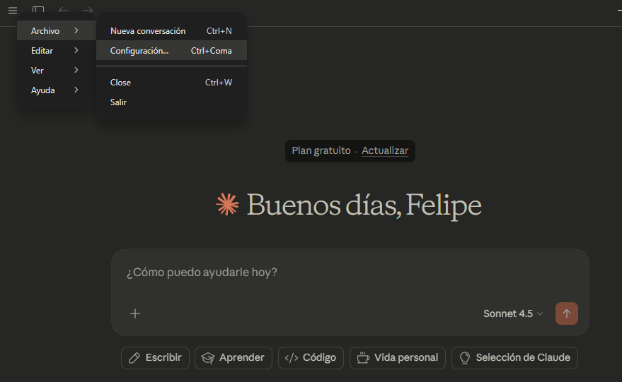
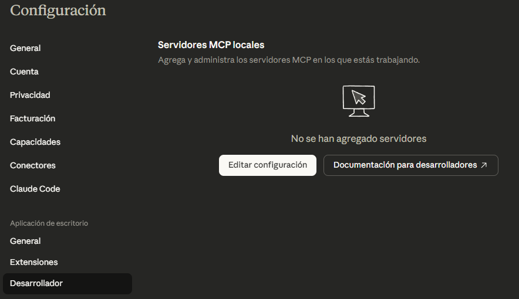
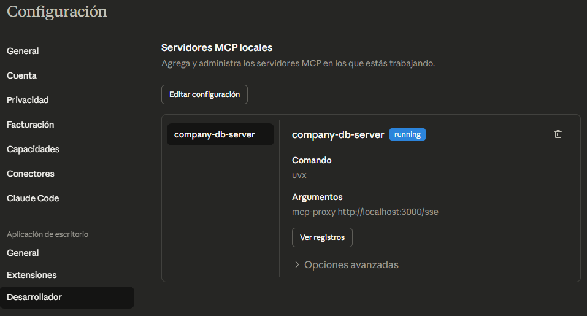

# CURSO DE FastMCP - MCP SERVER CUSTOM
## 1. Instalación de UV de Astro

UV es un gestor de paquetes para proyectos de JavaScript y TypeScript. Se utiliza para instalar y gestionar dependencias en el proyecto de FastMCP.

### Comando de instalación

```powershell
powershell -ExecutionPolicy ByPass -c "irm https://astral.sh/uv/install.ps1 | iex"
```

### Paso 1: Verificar la carpeta de instalación

El instalador debería haber puesto los archivos en:

```
C:\Users\lftob\.local\bin
```

Verifica con:

```cmd
dir C:\Users\lftob\.local\bin
```

Deberías ver:
- `uv.exe`
- `uvx.exe`
- `uvw.exe`

### Paso 2: Agregar a PATH (recomendado)

1. Presiona la tecla Windows
2. Escribe "Editar variables de entorno"
3. Abre "Editar las variables de entorno del sistema"
4. Haz clic en "Variables de entorno..."
5. Bajo "Variables de usuario para lftob":
    - Selecciona `Path`
    - Haz clic en "Editar"
    - Haz clic en "Nuevo"
    - Agrega: `C:\Users\lftob\.local\bin`

## 2. Creación de 2 archivos para el proyecto de FastMCP
Primero se crea el proyecto python:
```
uv init
uv venv
uv add fastmcp
uv add psycopg2
```
Luego se realiza la logica en *main.py*

## 3. Se hace la dockerización de la aplicación

Se realiza el contenido del Dockerfile y docker-compose.yml, junto a un archivo .env para las variables de entorno:

Ejemplo del *.env*:
```
POSTGRES_USER = ejemplo_nombre_usuario
POSTGRES_PASSWORD = ejemplo_clave
```

## 4. Se prepara un init.sql para crear la tabla
Como ejemplo se usa:
```
CREATE TABLE IF NOT EXISTS employees (
    id SERIAL PRIMARY KEY,
    name VARCHAR(100) NOT NULL,
    position VARCHAR(100) NOT NULL,
    department VARCHAR(50) NOT NULL,
    salary DECIMAL(10,2) NOT NULL,
    hire_date DATE NOT NULL DEFAULT CURRENT_DATE
);

INSERT INTO employees (name, position, department, salary) VALUES
('Ana García', 'Desarrolladora Senior', 'IT', 75000),
('Carlos López', 'Analista de Datos', 'Analytics', 65000),
('María Rodríguez', 'Diseñadora UX', 'Diseño', 60000);
```

Se crea el docker usando:
```
docker-compose up -d --build
```
Una vez estén corriendo los contenedores (fastmcp_yt-mcp_server y postgres:15-alpine) se puede registrar el MCP, en este ejemplo, con Claude Desktop.

## 5. Conexión desde Claude Desktop





Ejemplo de *claude_desktop_config.json*:
```
{
  "mcpServers": {
    "company-db": {
      "command": "uvx",
      "args": [
        "mcp-proxy",
        "http://localhost:3000/sse"
      ]
    }
  },
  "preferences": {
    "sidebarMode": "chat",
    "coworkScheduledTasksEnabled": false
  }
}
```
Se debe FINALIZAR toda tarea de Claude Desktop y reiniciar, y al volver a la configuración de desarrollador se debería ver ya el MCP (no debe haber otro servicio que consuma el MCP o puede haber errores al intentar usarlo):
